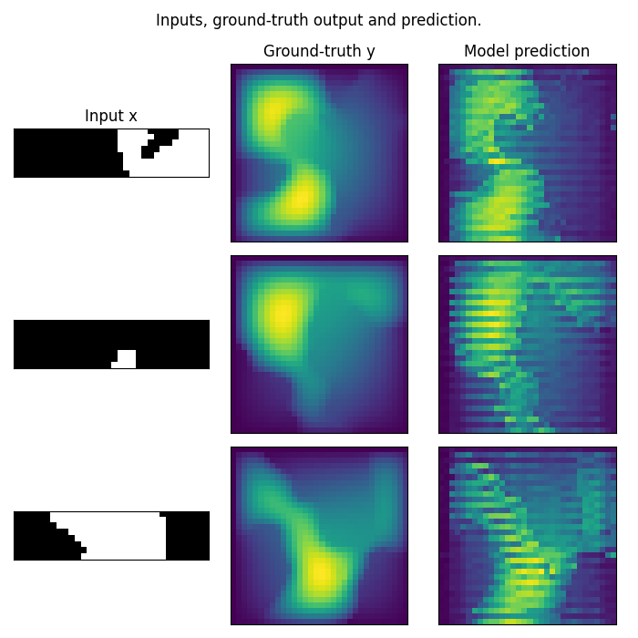

Scaling TFNO Training with Fully Sharded Data Parallel (FSDP)
==============================================================

In this tutorial, we will demonstrate how to efficiently scale the training of Temporal Fourier Neural Operators (TFNO) using Fully Sharded Data Parallel (FSDP) in PyTorch. This approach is particularly useful for training large models that do not fit into a single GPU memory.

Challenges of Scaling Neural Operators
--------------------------------------

Scaling neural operator models, like the Temporal Fourier Neural Operator (TFNO) used in this tutorial, introduces a unique set of challenges that are not as prevalent in traditional deep learning models. One of the key challenges lies in the use of complex tensors within neural operators.

Most existing parallelism and distributed training frameworks are primarily designed to support floating-point tensors. This limitation poses a problem for neural operators, which often leverage complex tensors to efficiently represent and manipulate data in applications like solving partial differential equations.

### Handling Complex Tensors

To overcome this challenge, a crucial step is the conversion of complex tensors into floating-point tensors. This conversion allows neural operators to utilize the wide range of optimizations and capabilities available in open-source libraries designed for floating-point computations. However, this conversion process must be carefully managed to preserve the integrity of the data and the efficiency of the computations.

### Customized Tensorfy Library

To facilitate this conversion, we employ a customized library, tentatively named ``tensorfy``. This library is designed to seamlessly transform complex tensors into a format compatible with floating-point libraries while maintaining the mathematical properties and operations specific to complex numbers.

The ``tensorfy`` library abstracts away the complexity of handling these conversions, allowing developers to focus on the design and optimization of their neural operator models. It ensures that the model can scale effectively across multiple GPUs using techniques like Fully Sharded Data Parallel (FSDP) without compromising the accuracy or efficiency of the computations.

.. note::
    The ``tensorfy`` library is slated for open-source release in the future. This library represents a significant step forward in making neural operator models more accessible and scalable, bridging the gap between specialized computational requirements and the capabilities of existing parallelism frameworks.

Prerequisites
-------------

Before we begin, ensure that you have the following installed:

- PyTorch
- Matplotlib
- The ``neuraloperator`` library

You can install the required libraries using pip:

.. code-block:: bash

    pip install torch matplotlib neuraloperator

Setup
-----

First, let's import the necessary libraries:

.. code-block:: python

    import torch
    import torch.nn as nn
    import matplotlib.pyplot as plt
    import sys
    from neuralop.models import TFNO
    from neuralop import Trainer
    from neuralop.datasets import load_darcy_flow_small
    from neuralop.utils import count_model_params
    from neuralop import LpLoss, H1Loss
    import torch.multiprocessing as mp
    import torch.distributed as dist
    from torch.distributed.fsdp import FullyShardedDataParallel
    import argparse

Distributed Environment Initialization
--------------------------------------

To utilize FSDP, we must initialize a distributed environment. The following function `benchmark` demonstrates how to set up the environment and distribute the model across multiple GPUs:

.. code-block:: python

    def benchmark(rank, args, world_size):
        device = 'cuda'
        RPC_PORT = 29501
        init_method_pgroup = f"tcp://localhost:{RPC_PORT}"
        torch.distributed.init_process_group(
            backend="nccl", rank=rank, world_size=world_size, init_method=init_method_pgroup
        )
        torch.cuda.set_device(rank)

Model and Dataset Preparation
-----------------------------

Next, we load the Darcy Flow dataset and initialize our TFNO model:

.. code-block:: python

        train_loader, test_loaders, data_processor = load_darcy_flow_small(
                n_train=1000, batch_size=32,
                test_resolutions=[16, 32], n_tests=[100, 50],
                test_batch_sizes=[32, 32],
                positional_encoding=True
        )
        data_processor = data_processor.to(device)
        
        model = TFNO(n_modes=(16, 16), hidden_channels=32, projection_channels=64, factorization='tucker', rank=0.42)
        model = model.to(device)

FSDP Configuration
------------------

We then wrap our model with FSDP to shard the model parameters:

.. code-block:: python

        fsdp_params = dict(mixed_precision=True, flatten_parameters=True)
        model = FullyShardedDataParallel(model)

Training
--------

After configuring our model with FSDP, we can proceed to train it:

.. code-block:: python

        optimizer = torch.optim.Adam(model.parameters(), lr=8e-3, weight_decay=1e-4)
        scheduler = torch.optim.lr_scheduler.CosineAnnealingLR(optimizer, T_max=30)
        
        l2loss = LpLoss(d=2, p=2)
        h1loss = H1Loss(d=2)
        
        train_loss = h1loss
        eval_losses = {'h1': h1loss, 'l2': l2loss}
        
        trainer = Trainer(model=model, n_epochs=20, device=device, data_processor=data_processor, use_distributed=True, verbose=True)
        
        trainer.train(train_loader=train_loader, test_loaders=test_loaders, optimizer=optimizer, scheduler=scheduler, training_loss=train_loss, eval_losses=eval_losses)

Visualization
-------------

Finally, we visualize the results:

.. code-block:: python

        test_samples = test_loaders[32].dataset
        # Visualization code here...

Main Function
-------------

To run the distributed training, use the following main function:

.. code-block:: python

    def parse_args():
        parser = argparse.ArgumentParser(description="benchmark")
        parser.add_argument("--max_batch", type=int, default=4, help="Max number of batches")

    if __name__ == "__main__":
        args = parse_args()
        num_devices = torch.cuda.device_count() if torch.cuda.is_available() else 1
        mp.spawn(
            benchmark,
            args=(args, num_devices),
            nprocs=num_devices,
            join=True,
        )

Results
-------

After completing the training process, we evaluate the model's performance by visualizing the inputs, the ground-truth output, and the model's predictions. This visualization helps in assessing the model's accuracy and its ability to generalize from the training data to unseen test data.

### Visualization of Model Predictions

Below is an example of the visualized results, showing the input features, the true solution (ground-truth), and the model's predictions for several test samples. These visualizations are crucial for understanding how well the model has learned to predict the flow fields from the given inputs.

From left to right, each row presents the input `x`, the ground-truth output `y`, and the model's prediction. The close resemblance between the ground-truth and the predictions indicates the model's effectiveness in capturing the underlying physical processes modeled by the Darcy Flow equations.

Memory Analysis
---------------

To understand the scaling behavior and efficiency of Fully Sharded Data Parallel (FSDP) compared to Distributed Data Parallel (DDP), we conduct a memory analysis by training larger models with incremental steps. The process involves the following setup:

1. **Data Loading**: We load a small Darcy Flow dataset to keep the focus on the memory usage rather than the dataset size:

.. code-block:: python

    train_loader, test_loaders, data_processor = load_darcy_flow_small(
        n_train=10, batch_size=32,
        test_resolutions=[16, 32], n_tests=[100, 50],
        test_batch_sizes=[32, 32],
        positional_encoding=True
    )
    data_processor = data_processor.to(device)

2. **Model Initialization**: We initialize a TFNO model with specified dimensions and parameters:

.. code-block:: python

    model = TFNO(n_modes=(64, 64), hidden_channels=256, projection_channels=512, factorization='tucker', rank=0.42)
    model = model.to(device)

### Comparative Memory Usage

To analyze the memory usage, we train the model using both DDP and FSDP strategies, referring to the code in `./neural_ddp.py` and `./neural_fsdp.py`. These scripts illustrate the setup and execution of training using the respective parallelism strategies.

### Results

Our training experiments on a configuration of 4 GPUs yielded the following memory usage results:

- **Distributed Data Parallel (DDP)**: The memory usage peaked at **10.498061GB**.
- **Fully Sharded Data Parallel (FSDP)**: The memory usage was significantly reduced, peaking at **6.566593GB**.

### Analysis

The memory analysis clearly demonstrates the advantage of using FSDP for training large models. By efficiently sharding the model parameters across all available GPUs, FSDP reduces the overall memory footprint, allowing for the training of larger models or enabling the use of larger batch sizes.

This reduction in memory usage is particularly important when scaling up the training process to accommodate more complex models or larger datasets. FSDP's ability to minimize memory consumption without compromising training speed or model accuracy represents a significant step forward in distributed deep learning.

Conclusion
----------

The ability to visualize the outcomes of neural operator models, such as the TFNO trained in this tutorial, is essential for verifying their effectiveness and for identifying potential areas of improvement. As we continue to develop and refine these models, incorporating advanced techniques like Fully Sharded Data Parallel (FSDP) and handling the challenges of complex tensor operations, we move closer to solving increasingly complex problems across various scientific and engineering domains.

